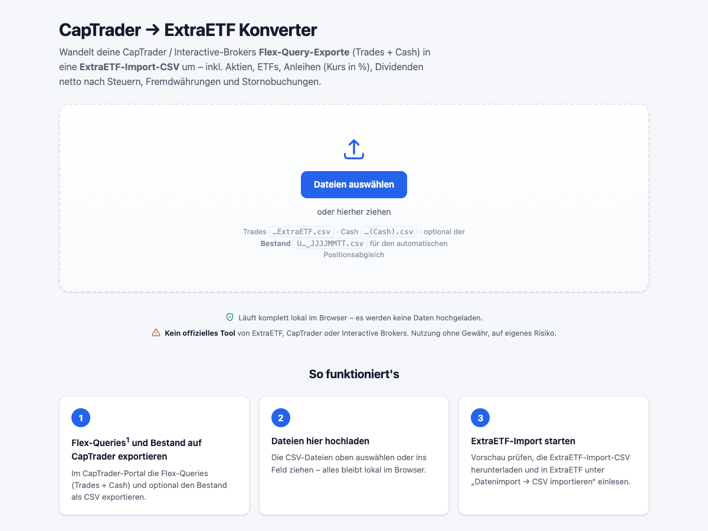

# ExtraETF Konverter

Tool zur Konvertierung von Broker-Depot-Exporten in ExtraETF-Import-CSVs. Unterstützte Broker (werden je Datei automatisch erkannt, auch gemischt hochladbar):

- **CapTrader** (Interactive Brokers): Flex-Query-Exporte *Trades* + *Cash* · optional *Bestand* für den Positionsabgleich
- **GenoBroker** (GENO Broker GmbH / Volks- und Raiffeisenbanken): *Depotumsätze*-CSVs · optional *Depotbestand* für den Positionsabgleich
- **Weltsparen** (Raisin): *Transaktionen*-CSV des Verrechnungskontos (Tages-/Festgeld) → kategorisierte Cash-Buchungslisten (Zinsen, Steuern, Ein-/Auszahlungen)



## Hinweise

> [!WARNING]
> **Kein offizielles Tool von ExtraETF, CapTrader oder Interactive Brokers.** Nutzung ohne Gewähr, auf eigenes Risiko.

> [!NOTE]
> **Datenschutz:** Läuft lokal im Browser – kein Server, keine Netzwerkaufrufe, keine Uploads.

## Warum dieses Tool?

**CapTrader:** ExtraETF bietet zwar einen Interactive-Brokers-Import über WealthAPI an (auch für CapTrader), doch die Einbindung ist fehleranfällig und die Daten unvollständig – z. B. werden ISINs abgeschnitten. Verlässlicher ist der manuelle Export als *Flex-Query*-CSV, dessen Format aber nicht zum ExtraETF-Import passt. Dieses Tool rechnet die Exporte automatisch um (inklusive Anleihen, Fremdwährung, Quellensteuer, Stornos, Corporate Actions), sodass der importierte Depotwert dem CapTrader-Auszug entspricht.

**GenoBroker:** Für GenoBroker gibt es gar keine ExtraETF-Anbindung, und die *Depotumsatzanzeige*-CSV passt nicht zum Import-Format: Semikolon-Format mit eigenem Kopfblock, nur WKNs statt ISINs, auf 2 Nachkommastellen gerundete Stückzahlen, gerundete Ausführungskurse (bei Sparplänen zählt der abgebuchte Betrag) und Buchungsarten wie Depotüberträge oder Vorabpauschale, die ExtraETF nicht kennt. Dieses Tool übersetzt all das und gleicht auf Wunsch gegen den *Depotbestand* ab, sodass die importierten Positionen exakt dem Depotauszug entsprechen.

**Weltsparen:** Tages- und Festgeld sind keine Wertpapiere – der ExtraETF-CSV-Import kann davon nichts einlesen, alles läuft über manuelle Cash-Buchungen. Der Transaktions-Export des Weltsparen-Verrechnungskontos ist dafür unhandlich: ein einziger Buchungsstrom, in dem sich Ein-/Auszahlungen, interne Umbuchungen zu den Partnerbanken, Zinsgutschriften und Steuerabzüge (nur als AGS/KIST/SOLI-Kürzel im Verwendungszweck) mischen. Dieses Tool sortiert die Buchungen automatisch in genau die Kategorien, die in ExtraETF zu erfassen sind – und filtert die internen Umbuchungen heraus, die man **nicht** buchen darf.

## Was es kann

### CapTrader

- **Trades** → `Kauf` / `Verkauf` (inkl. Gebühren, Fremdwährung, Wechselkurs)
- **Anleihen** → Kurs in % des Nominals, Nominalwert als Anzahl
- **Dividenden** → brutto mit zugeordneter Quellensteuer (netto = Preis − Steuern)
- **Stornobuchungen** (`BUY (Ca.)`) → über die vorzeichenbehaftete Stückzahl korrekt gegengebucht
- **Fremdwährungen** → Wechselkurs = Einheiten je EUR (= 1 / `FXRateToBase`)
- **Optionaler Bestandsabgleich:** mit CapTrader-*Bestand* ergänzt der Konverter `Einbuchung` / `Ausbuchung`, sodass die Positionen exakt dem Auszug entsprechen (z. B. bei Corporate Actions).

### GenoBroker

Quelle ist der CSV-Export der **Depotumsatzanzeige** (`Depotumsaetze_<Depot>_<Datum>.csv`, im Online-Depot unter „Depot → Depotumsätze“) – bei Bedarf mehrere Exporte für die volle Historie. Optional zusätzlich der **Depotbestand** (`Depotbestand_….csv`) für den exakten Positionsabgleich.

- **Käufe / Verkäufe** (`TRANSAKTIONSART_KAEUFE` / `…_VERKAEUFE`) → `Kauf` / `Verkauf` inkl. Spesen und Steuern
- **Sparplan-genau:** als Preis wird `Kurswert ÷ Stück` verwendet (nicht der gerundete Ausführungskurs), damit `Preis × Anzahl` exakt dem abgebuchten Betrag entspricht (z. B. 400,00 €-Sparrate); das funktioniert auch bei älteren Exporten, in denen die Ausführungskurs-Spalte den Abrechnungsbetrag enthält
- **Überlappende Exporte** werden automatisch dedupliziert (gleiche Auftrags-Nr. = gleiche Buchung) – einfach alle Umsatz-CSVs zusammen hochladen
- **Depotüberträge** (`TRANSAKTIONSART_AUSLIEFERUNGEN` / `…_EINLIEFERUNGEN`) → `Ausbuchung` / `Einbuchung`
- **Ausschüttungen** (`ERTRAGSART_AUSSCHUETTUNGEN`) mit Bruttobetrag → `Dividende` (brutto, Steuern zugeordnet)
- **Vorabpauschale** (Ausschüttungszeile ohne Brutto, nur Steuern – typisch Anfang Januar bei thesaurierenden Fonds) → nicht per CSV importierbar; wird unter „Hinweise“ und „Cash / Kontobuchungen“ zum manuellen Erfassen aufgelistet
- **Bestandsabgleich:** mit dem *Depotbestand* ergänzt der Konverter `Einbuchung` / `Ausbuchung`, sodass die Positionen exakt dem Auszug entsprechen. Das gleicht auch die **Rundung der Umsatzanzeige** aus: dort sind Stückzahlen auf 2 Nachkommastellen gerundet, der Bestand führt 4 – ohne Abgleich weichen Sparplan-Positionen daher um wenige Tausendstel Stück ab

> [!IMPORTANT]
> GenoBroker exportiert nur **WKNs**, keine ISINs. Die WKN wird in die ISIN-Spalte geschrieben – nach dem Import prüfen, ob ExtraETF alle Wertpapiere erkannt hat, und die WKN sonst in der CSV durch die ISIN ersetzen.

### Weltsparen

Quelle ist der CSV-Export der **Transaktionen** des Weltsparen-Verrechnungskontos (`transactions-JJJJ-MM-TT.csv`, auf weltsparen.de unter „Transaktionen“). Da Tages-/Festgeld nicht CSV-importierbar ist, erzeugt der Konverter **keine Import-CSV**, sondern kategorisierte Buchungslisten für die manuelle Erfassung (bzw. den [Agenten](#automatisierung-agent--skill)):

- **Buchungsplan**: eine fertige Liste aller Cash-Buchungen mit Datum, ExtraETF-Typ, Betrag und Kommentar – Einzahlungen (`Gutschrift`), Auszahlungen (`Abbuchung`), Zinsen und Steuern (`Zinsen/Gebühren`), **alles je Jahr aggregiert** und datiert auf die letzte Buchung des Jahres. So bleiben es auch bei jahrelanger Historie nur eine Handvoll Buchungen (ExtraETF kann Cash weder per CSV importieren noch Weltsparen per Auto-Sync anbinden – jede Buchung ist Handarbeit); die Jahresend-Salden stimmen exakt, nur der unterjährige Vermögensverlauf ist geglättet
- **Zinsen** (Zinsauszahlungen der Festgelder) werden erkannt und je Jahr summiert
- **Steuern** (Abzüge der Raisin Bank): Abgeltungsteuer, Soli und Kirchensteuer werden aus dem Verwendungszweck (`AGS…`, `SOLI…`, `KIST…`) aufgeschlüsselt und stehen im Jahres-Kommentar; Gebühren gibt es im Export nicht
- **Interne Umbuchungen** (Verrechnungskonto ↔ Tages-/Festgeld bei den Partnerbanken) werden erkannt und aussortiert – sie dürfen **nicht** gebucht werden, das Geld bleibt ja bei Weltsparen
- **Überlappende Exporte** werden dedupliziert – einfach alle Transaktions-CSVs zusammen hochladen
- Als Kontrolle zeigt der Konverter den **Saldo des Verrechnungskontos** laut Export sowie Summen je Kategorie

Empfohlenes Setup in ExtraETF: **ein Depot „Weltsparen“** anlegen, dessen Verrechnungskonto („Berücksichtigen“ aktivieren) den gesamten Weltsparen-Bestand abbildet, und den Buchungsplan abarbeiten. Nach dem Buchen entspricht der Kontostand `Einzahlungen − Auszahlungen + Zinsen − Steuern`.

> [!IMPORTANT]
> **Tagesgeld-Zinsen** schreibt Weltsparen direkt dem Tagesgeldkonto gut – im Verrechnungskonto-Export tauchen sie nicht separat auf, sondern stecken in Rückzahlungen ohne Verwendungszweck (der Konverter markiert diese). Die Zinshöhe lässt sich je Partnerbank-Konto rekonstruieren (Rückflüsse − Anlagen bei aufgelösten Konten) und wird am besten als `Zinsen`-Buchung im Jahr der Kontoauflösung nachgetragen.

> [!IMPORTANT]
> **Festgeld-Verlängerungen** laufen nicht über das Verrechnungskonto: Wird ein Festgeld bei Fälligkeit verlängert, wandert Anlagebetrag + Zins direkt in die neue Anlage – im Export fehlt dann die Rückzahlungs-Zeile. Das ist normal; zum Abgleich die Kachel „Noch angelegt (lt. Export)“ mit den echten Weltsparen-Beständen vergleichen.

## Voraussetzungen

### CapTrader: Flex Queries einrichten

Im CapTrader-/IB-Kundenportal unter `Berichte → Flex Queries` zwei Flex-Queries z. B. mit folgenden Namen anlegen:
  - `ExtraETF`: Abschnitt **'Trades'** aktivieren
  - `ExtraETF (Cash)`: Abschnitt **'Bartransaktionen'** aktivieren

Beide Queries werden identisch konfiguriert – **bis auf die Wechselkurse**.

**Felder (Spalten)** – beim Anlegen der Query je Abschnitt mindestens diese Felder auswählen:

| Feld | Trade-Query | Cash-Query |
| :--- | :---: | :---: |
| `CurrencyPrimary` | ✓ | ✓ |
| `FXRateToBase` | ✓ | ✓ |
| `AssetClass` | ✓ | |
| `Symbol` | ✓ | |
| `Description` | ✓ | ✓ |
| `ISIN` | ✓ | |
| `ListingExchange` | ✓ | |
| `TradeDate` | ✓ | |
| `Quantity` | ✓ | |
| `TradePrice` | ✓ | |
| `Taxes` | ✓ | |
| `IBCommission` | ✓ | |
| `Buy/Sell` | ✓ | |
| `Date/Time` | | ✓ |
| `Amount` | | ✓ |
| `Type` | | ✓ |

**Zustellungskonfiguration**

| Einstellung | Wert |
| :--- | :--- |
| Format | CSV |
| Überschrift und Trailer-Daten miteinbeziehen | Nein |
| Spaltenüberschriften miteinbeziehen | Ja |
| Einzelne Spalten-Titelzeile anzeigen | Nein |
| Abschnittscode und Zeilenbeschriftung miteinbeziehen | Nein |

**Allgemeine Konfiguration**

| Einstellung | Wert |
| :--- | :--- |
| Datumsformat | `dd/MM/yyyy` |
| Zeitformat | `HH:mm:ss` |
| Datum/Uhrzeit-Trennzeichen | `' '` (Leerzeichen) |
| Include Offsetting Trade/Cancel Pairs | Nein |
| **Wechselkurse miteinbeziehen** | Trades → Nein · Cash → Ja |
| Prüfpfadfelder einbeziehen | Nein |
| Aufschlüsselung nach Tagen | Nein |

Übrige Optionen (Modelle, Gewinn und Verlust, Konto-Pseudonym) bleiben auf Standard.

### CapTrader: Bestand exportieren (optional)

Der *Bestand* für den optionalen Bestandsabgleich wird im Kundenportal aus der Umsatzübersicht (`Berichte → Kontoauszüge → Kontoauszug`) als CSV exportiert.

### GenoBroker: Depotumsätze & Depotbestand exportieren

Beides im GenoBroker-Online-Depot, keine Einrichtung nötig:

- **Depotumsätze** (`Depotumsaetze_<Depot>_<Datum>.csv`): in der *Depotumsatzanzeige* den Zeitraum wählen und als CSV exportieren. Für die **volle Historie seit Depoteröffnung** ggf. mehrere Zeiträume exportieren und alle Dateien zusammen hochladen – Überlappungen sind unkritisch, der Konverter dedupliziert über die Auftrags-Nr.
- **Depotbestand** (`Depotbestand_<Depot>_<Datum>.csv`, optional, empfohlen): die *Depotbestand*-Ansicht als CSV exportieren. Damit gleicht der Konverter die Positionen exakt ab – wichtig, weil die Umsatzanzeige Stückzahlen auf 2 Nachkommastellen rundet.

### Weltsparen: Transaktionen exportieren

Auf weltsparen.de unter **„Transaktionen“** die Umsätze des Verrechnungskontos als CSV herunterladen (`transactions-JJJJ-MM-TT.csv`), keine Einrichtung nötig. Für die volle Historie ggf. mehrere Zeiträume exportieren – Überlappungen dedupliziert der Konverter.

## Schnellstart

1. Dieses Repository herunterladen und ggf. entpacken.
2. `extraetf-konverter.html` im Browser öffnen (Doppelklick genügt – kein Server nötig).
3. Die Broker-CSVs hineinziehen – die Bank wird je Datei automatisch erkannt:
   - **CapTrader:** Trades + Cash, optional den *Bestand*
   - **GenoBroker:** alle Depotumsätze-Exporte, optional den *Depotbestand*
   - **Weltsparen:** alle Transaktionen-Exporte
4. Vorschau und Hinweise prüfen.
5. „ExtraETF-Import-CSV herunterladen" → `extraetf-import.csv`.
6. In ExtraETF unter `Datenimport → CSV importieren` einlesen.

Bei Weltsparen entfallen die Schritte 5–6: Es gibt nichts zu importieren, die Cash-Buchungslisten aus Schritt 4 werden manuell (oder per Agent) in ExtraETF erfasst.

## Manuell nachzupflegen

ExtraETF importiert nur Wertpapier-Transaktionen. Cash-Bewegungen müssen manuell oder per Agenten nachgetragen werden. Der Konverter listet diese in der Kategorie „Cash / Kontobuchungen".

### Cash-Bewegungen

Erfasse sie auf ExtraETF über `Neue Aktivität → Cash`. Aktiviere beim betroffenen Verrechnungskonto „Berücksichtigen", damit Cash zum Gesamtvermögen zählt.

| Cash-Bewegung | Broker | Erfassung |
| :--- | :--- | :--- |
| Ein-/Auszahlungen | CapTrader | Cash-Buchung |
| Broker-Zinsen | CapTrader | Cash-Buchung |
| Gebühren | CapTrader | Cash-Buchung |
| Quellensteuer auf Zinsen | CapTrader | Cash-Buchung |
| Anleihe-Stückzinsen | CapTrader | Cash-Buchung |
| Anleihe-Kupons | CapTrader | [`Dividende`](#bekannte-extraetf-besonderheiten) |
| Vorabpauschale | GenoBroker | Cash-Buchung (Abbuchung der Steuer) |
| Ein-/Auszahlungen | Weltsparen | Cash-Buchung |
| Zinsen (Tages-/Festgeld) | Weltsparen | Cash-Buchung |
| Abgeltungsteuer/Soli/Kirchensteuer | Weltsparen | Cash-Buchung |
| Tagesgeld-Zinsen (im Export versteckt) | Weltsparen | Cash-Buchung bei Kontoauflösung |

### Verrechnungskonto

**CapTrader:** Kontostand auf den CapTrader-Endbarsaldo abgleichen (dokumentierte Zahlungsströme als Cash-Buchungen, verbleibende FX-/Rundungsdifferenz als eine Ausgleichsbuchung).

**GenoBroker:** Es gibt kein Broker-Verrechnungskonto – Sparplanraten und Abrechnungsbeträge laufen über das hinterlegte Referenzkonto (Girokonto). In ExtraETF daher entweder die Option „Negative Kontostände ausgleichen" aktiv lassen oder die Abbuchungen als Einzahlungen auf das Verrechnungskonto nachbuchen.

**Weltsparen:** Ein Verrechnungskonto je Weltsparen-Konto führen und „Berücksichtigen" aktivieren – es bildet das gesamte Weltsparen-Guthaben ab (Verrechnungskonto + angelegtes Tages-/Festgeld). Gebucht werden nur Einzahlungen, Auszahlungen, Zinsen und Steuern; die internen Umbuchungen zu den Partnerbanken nicht.

## Automatisierung (Agent & Skill)

> [!CAUTION]
> Der Agent bucht in deinem echten ExtraETF-Konto. Nutzung auf eigenes Risiko – Ergebnisse selbst prüfen.

Nachbuchungen lassen sich mit einem Claude-Code-Agenten und dem Skill [`extraetf-import-ops`](.claude/skills/extraetf-import-ops/) automatisieren: Das Skill kennt die UI-Abläufe der ExtraETF-Web-App, der Agent steuert den Browser und bucht, was der CSV-Import nicht abdeckt.

1. Der Konverter listet unter „Cash / Kontobuchungen" alle nicht-importierbaren Buchungen samt Ziel-Endbarsaldo.
2. Du meldest dich selbst bei app.extraetf.com an – der Agent hält keine Zugangsdaten.
3. Der Agent bucht per `Neue Aktivität → Cash` Ein-/Auszahlungen, Zinsen, Gebühren und Steuern, die Kupons als `Dividende` auf die jeweilige Anleihe und gleicht zuletzt das Verrechnungskonto auf den CapTrader-Endbarsaldo ab.
4. Nach jeder Buchung liest er den Wert zurück und prüft das Verrechnungskonto, bevor er weitermacht.

Der Agent arbeitet nur am angegebenen Depot, fragt vor jeder Buchung nach (sofern nicht freigegeben) und steuert ausschließlich die Oberfläche – kein direkter API- oder Token-Zugriff.

## Bekannte ExtraETF-Besonderheiten

Der Konverter erzeugt eine korrekte CSV; die folgenden Punkte liegen an ExtraETF:

- Der **Wertpapier-`Typ`** wird automatisch anhand der ISIN erkannt. Die CSV-Spalte ist nur ein Hinweis.
- Der **Wechselkurs bei Dividenden** wird ignoriert und der Preis/Steuern in EUR gebucht (*318 HKD → 318 €*). Käufe und Verkäufe werden hingegen korrekt umgerechnet. Workaround: Fremdwährungs-Dividenden in EUR buchen (`Währung=EUR`).
- Es gibt keinen **`Kupon`-Typ**. Anleihe-Kupons müssen daher z.B. als `Dividende` auf die jeweilige Anleihe gebucht werden (Betrag in „Dividendensumme (vor Steuern)", die Position bleibt unverändert).
- Nach einem **Split mit ISIN-Wechsel** kann eine Position mit dem veralteten Vor-Split-Kurs bewertet werden. Ursache: Dem Investment ist durch die Kapitalmaßnahme ggf. kein Börsenplatz zugeordnet, daher wird kein aktueller Kurs gezogen. Lösung: Beim Investment über die drei Punkte (⋮) → „Bearbeiten" einen **Börsenplatz** wählen (z. B. Stuttgart) — danach wird der aktuelle Kurs verwendet.
- **Cash-Zinsen zählen nicht zur Performance:** Performance (Heute, Seit Kauf, IZF), Dividenden und die Seite „Gewinn & Verlust" werden ausschließlich aus **Wertpapier-Transaktionen** berechnet. Cash-Buchungen vom Typ `Zinsen/Gebühren` erhöhen nur den Kontostand/das Gesamtvermögen — ein reines Tages-/Festgeld-Depot zeigt daher trotz gebuchter Zinsen 0 % Rendite. Einen Cash-Buchungstyp `Dividenden` gibt es nicht (nur Gutschrift, Abbuchung, Zinsen/Gebühren, Steuererstattung, Sonstiges); ein sauberer Workaround existiert nicht.

## Aufbau (neue Bank ergänzen)

Der Code ist in Module je Bank aufgeteilt – alles abhängigkeitsfrei und rein clientseitig:

```
js/core.js                   Shared: CSV-Parser, Zahlen/Datums-Helfer, ExtraETF-Spec, Registry
js/converters/captrader.js   CapTrader/IB-Konverter
js/converters/genobroker.js  GenoBroker-Konverter
js/converters/weltsparen.js  Weltsparen/Raisin-Konverter (nur Cash-Buchungslisten)
js/app.js                    UI (Upload, Erkennung, Vorschau, Download)
```

Eine neue Bank ist eine Datei unter `js/converters/`, die `ExtraETF.register({ id, label, kindLabels, detect(text, fileName), convert(files) })` aufruft (Contract-Doku in `js/core.js`) und in `extraetf-konverter.html` als `<script>` eingebunden wird.

## Lizenz

Siehe [`LICENSE`](LICENSE).
